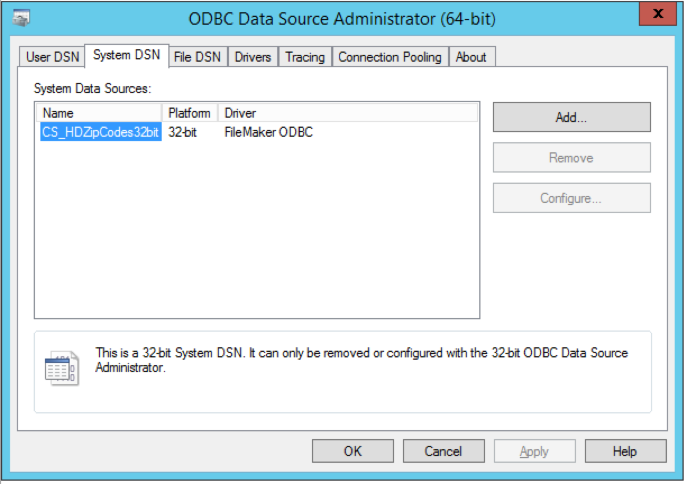

# Accessing FileMaker in Laravel via ODBC Experiment

I'm working on a web project where I'm going to need to access a FileMaker database. 

In previous projects I had used the FileMaker PHP API, but knowing how out of date the PHP API is and seeing how poorly it played with Laravel (the server side framework I'll be using) I decided to strike that from the possibilities list. 

From there, it seemed like the best options I had were:

- Using a php bundle to connect to FileMaker
    - For this I explored [SimpleFM](https://github.com/soliantconsulting/SimpleFM) by [Soliant Consulting](http://www.soliantconsulting.com/)
- Using a tool on the server side to make it easier to access FileMaker
    - For this I explored the recently open sourced [RestFM](https://github.com/GoyaPtyLtd/RESTfm) by [Goya](http://www.goya.com.au/)
- Trying to access FileMaker from Laravel via ODBC
    - For this I explored [Laravel ODBC Connector](https://github.com/bencarter78/odbc) by [Ben Carter](https://github.com/bencarter78)

The last option is I'll be talking about here.

## The results up front

Before I dive into the explanation on how I was able to connect Laravel to FileMaker via ODBC, I want to tell you that while I got a successful connection, **this method is a dead end (for now)**. 

I was able to successfully connect to FileMaker via OBDC and perform general queries (e.g. `$zips = ZipCode::all()` worked), but the grammar that the ODBC driver uses includes keywords that are not available with FileMaker ODBC (e.g. using the eloquent command `$zip = ZipCode::find(1)` generates the sql query  `select * from "ZipCodes" where "ZipCodes"."id" = 1 limit 1` and the `LIMIT` keyword is not available in FileMaker via odbc). 

I wouldn't be surprised if there was a way to alter the grammar used by the Laravel ODBC Connector so that queries used only the grammar available in FlieMaker, but that's a shiny object that I don't have time to explore right now.

So, all of that said, here's now I got Laravel to talk to FileMaker.

## The Infrastructure Prerequisites

### The Web Server

Accessing FileMaker via ODBC requires the use of the [FileMaker ODBC Driver](http://help.filemaker.com/app/answers/detail/a_id/12921/~/software-update%3A-filemaker-xdbc-client-drivers-for-filemaker). This driver needs to be installed on the server you're hosting the Laravel web code from. These drivers are only available for Windows and Mac OS so your website will need to be hosted from either a Windows or Mac OS box (:/). 

I created this project using a Windows Server 2012 R2 with PHP 5.5.11.

### FileMaker Server

This also requires FileMaker server installed with ODBC/JDBC access turned on. 

# Project Setup

## Host the demo database

I used a demo database I created called [ZipCodes](database/). This is a simple database I use when I'm testing out new tools. You'll need to host this database on your FileMaker Server.

 The credentials for this file are:

#### Admin account
- username: admin
- password: demoadmin

#### Demo account
- username: demo
- password: demo

**Note: If you're going to host this database on a publicly accessible FileMaker server, change the admin username and password.**

## Creating the DSN

You'll need to create a DSN that points to your FileMaker DSN.

You may be able to use a dsn-less string to connect instead of using this DSN (I show an example of how to do this in the [FileMakerViaOdbcConnect](FileMakerViaOdbcConnect.php) file), but I didn't try it with the laravel project.

Once you've created the DSN, test it to make sure it can access the ZipCodes file.

## Optional initial tests

I've included two of the stripped down files I used to test my connection to the database from PHP before I tried connecting in laravel. If you want, you can use these two fields to verify you can connect:

- FileMakerviaOdbcConnect.php
- FileMakerviaPdoOdbc.php

If you do use these files to test, make sure you update the name of the DSN in the code to match the one you created on your server.

## Setting up the Laravel project

- Checkout this project and move the `LaravelAndFileMakerViaOdbc` into your webroot
- In the command line, cd into the `LaravelAndFileMakerViaOdbc` folder and run the command to install all of the project's dependencies:

    composer install

- Then change the name of the `.env.example` file to `.env`
    - Note that if you have a different DSN name and/or if you've changed the credentials for your copy of the ZipCodes file, you'll need to update the `ODBC_` values in `.env`
    - If you do update the `ODBC_DSN` value, make sure you still leave the `odbc:` prefix, e.g. `ODBC_DSN="odbc:NewDsnName`
- Then run the following command to generate the app key:

    php artisan key:generate

Now you should be able to open your browser, navigate to your server's webroot and see a dump of all of the zip codes within the project (review the `/` route in the file `app/Http/routes.php` ).

# Watching it break

In your browser, if you add `zip` to your url you'll see an exception thrown.

This is happening because the sql query used uses the key word `LIMIT`. If you review the FileMaker ODBC guide, you'll see that LIMIT isn't included in the grammar. 

---

This is where I stopped. While it may be possible to alter the grammar, it's not something I can do within the budget of my project. 

At some point I may come back to this and bang out a solution, but it probably won't be any time soon. It would be nice to be able to use Eloquent to access FileMaker data, but with other integration options like SimpleFM and RestFM I don't know if it's worth the time to hammer out.